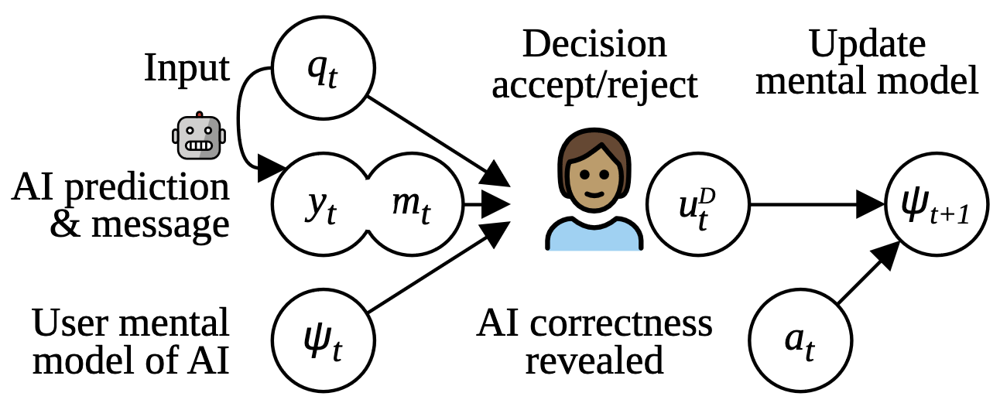

# A Diachronic Perspective on User Trust in AI under Uncertainty

> In a human-AI collaboration, users build a mental model of the AI system based on its veracity and how it presents its decision, e.g. its presentation of system confidence and an explanation of the output. 
> However, modern NLP systems are often uncalibrated, resulting in confidently incorrect predictions that undermine user trust.
> In order to build trustworthy AI, we must understand how user trust is developed and how it can be regained after potential trust-eroding events.
> We study the evolution of user trust in response to these trust-eroding events using a betting game as the users interact with the AI. 
> We find that even a few incorrect instances with inaccurate confidence estimates can substantially damage user trust and performance, with very slow recovery.
> We also show that this degradation in trust can reduce the success of human-AI collaboration
> and that different types of miscalibration---unconfidently correct and confidently incorrect---have different (negative) effects on user trust.
> Our findings highlight the importance of calibration in user-facing AI application, and shed light onto what aspects help users decide whether to trust the system. 

This work is accepted at EMNLP 2023, read it [here](https://arxiv.org/abs/2310.13544).
```
@misc{dhuliawala-zouhar-2023-diachronic,
  title={A Diachronic Perspective on User Trust in AI under Uncertainty}, 
  author={Shehzaad Dhuliawala and Vilém Zouhar and Mennatallah El-Assady and Mrinmaya Sachan},
  year={2023},
  eprint={2310.13544},
  archivePrefix={arXiv},
  primaryClass={cs.CL}
}
```



<small>
Figure 1: Diachronic view of a typical human-AI collaborative setting.
Here, at each timestep <em>t</em>, the user uses their prior mental model <em>ψ<sub>t</sub></em> to accept or reject the AI system’s answer <em>y<sub>t</sub></em>, supported by an additional message <em>m<sub>t</sub></em> comprising of the AI’s confidence, and updates their mental model of the AI system to <em>ψ<sub>t+1</sub></em>. If the message is rejected, the user invokes a fallback process to provide a different answer.
</small>

## Building User Interface

First, generate user queues with `python3 src_queues/baked_queues/generate_base.py` (or `generate_with_types.py`).

Then, the source can be built as 
```bash
cd src_ui
npm install
npm run dev # to launch the server locally
npm run build # to generate JS that can be uploaded
```

## Collected Data and Analysis

The collected data is stored in `data/collected_users.jsonl.tar.gz`.
Unpack as:

<!-- maximum compression: -->
<!-- tar cvf - data/collected_users.jsonl | gzip -9 - > data/collected_users.jsonl.tar.gz -->

```bash
tar -xvzf data/collected_users.jsonl.tar.gz
# 18664
wc -l data/collected_users.jsonl
```

and load in Python as:

```python
import json
data = [json.loads(x) for x in open("data/collected_users.jsonl", "r")]
```

The figures and tables in the paper are generated by scripts in `src_analysis`.

## Misc.

This is a code & data repository for a paper currently under review.
This is a group effort by members of ETH Zurich, Department of Computer Science.
